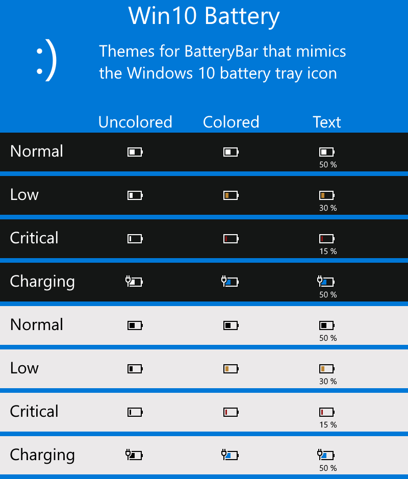

# Windows 10 BatteryBar Pro theme

3 BatteryBar themes that mimic the Windows 10 battery tray icon:
- "Uncolored" which is the exact same as Windows 10;
- "Colored" which adds colors according to the state of the battery;
- "Text" which is the colored theme with the percentage of the battery written below it.

### Preview

### Installation
- Download [here](https://github.com/BenDavidson90/batterybar-win10battery/archive/master.zip)
- Unzip `batterybar-win10battery-master.zip`
- Copy the `batterybar-win10battery-master` folder into the `C:\Program Files\BatteryBar\Themes` folder
- The theme should appear in the theme selector in the BatteryBar Pro preferences window

### License
MIT